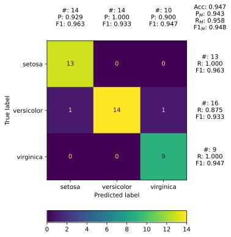
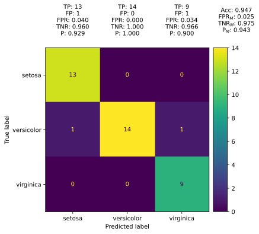
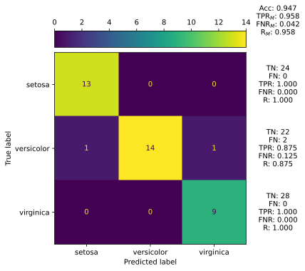

<h1 align="center">Daze</h1>

<p align="center">
    <sup><em>Better multi-class confusion matrix plots for Scikit-Learn, incorporating per-class and overall evaluation measures.</em></sup>
</p>

<div align="center">
    <a href="https://pypi.org/project/daze">
        
    </a>
    <!-- Hide until tests are implemented
    <a href="https://pypi.org/project/daze">
        
    </a>
    -->
    <a href="https://raw.githubusercontent.com/eonu/daze/master/LICENSE">
        
    </a>
    <a href="https://daze.readthedocs.io/en/latest">
        
    </a>
    <!-- Hide until tests are implemented
    <a href="https://travis-ci.org/eonu/daze">
        
    </a>
    -->
</div>

## Introduction



The [`sklearn.metrics`](https://scikit-learn.org/stable/modules/classes.html#module-sklearn.metrics) module allows for the plotting of a confusion matrix from a
classifier (with [`plot_confusion_matrix`](https://scikit-learn.org/stable/modules/generated/sklearn.metrics.plot_confusion_matrix.html#sklearn.metrics.plot_confusion_matrix)), or directly from a pre-computed confusion matrix (with the internal [`ConfusionMatrixDisplay`](https://scikit-learn.org/stable/modules/generated/sklearn.metrics.ConfusionMatrixDisplay.html#sklearn.metrics.ConfusionMatrixDisplay) class).

A confusion matrix shows the discrepancy between the true labels of a dataset and the labels predicted by a classifier.

While the confusion matrix plots generated by Scikit-Learn are very informative, they omit important evaluation measures that can summarize classification performance. True positives, precision, F1 score and accuracy are example of such measures – all of which can be derived from the confusion matrix. The [`classification_report`](https://scikit-learn.org/stable/modules/generated/sklearn.metrics.classification_report.html#sklearn.metrics.classification_report) function in the same module provides these measures.

Daze adjusts `plot_confusion_matrix` to incorporate these evaluation measures directly in the confusion matrix plot, while still maintaining a very similar API
to the original Scikit-Learn function.

## Features

- Similar API to Scikit-Learn's `plot_confusion_matrix`.
- All common [confusion matrix measures](https://daze.readthedocs.io/en/latest/sections/measures.html#types-of-measures):<br/>
  _Accuracy, TP, FP, TN, FN, TPR, FPR, TNR, FNR, Precision, Recall, F1_.
- Macro & micro averaging for overall evaluation measures:<br/>
  _TPR, FPR, TNR, FNR, Precision, Recall, F1_.
- Supports both classifiers and pre-computed confusion matrices.

## Documentation

The package API remains largely the same as that of `sklearn.metrics.plot_confusion_matrix` with a few additions and changes to the function arguments:

<details>
<summary>
    <b>Click here to view the changes.</b>
</summary>
<p>

- `estimator` (_changed_): Supports the usual fitted Scikit-Learn classifier (or [`sklearn.pipeline.Pipeline`](https://scikit-learn.org/stable/modules/generated/sklearn.pipeline.Pipeline.html)), but also now accepts a pre-computed confusion matrix.
- `X` (_changed_): If `estimator` is a classifier, then `X` are input values as usual. If `estimator` is a confusion matrix, then `X` should be set to `None`.
- `y_true` (_changed_): If `estimator` is a classifier, then `y_true` are target values as usual. If `estimator` is a confusion matrix, then `y_true` should be set to `None`.
- `normalize` (_added_): Whether or not to normalize the plotted confusion matrix (`True`/`False`). Note that if a confusion matrix is provided, it should always be un-normalized.
- `include_measures` (_added_): Whether or not to include evaluation measures in the confusion matrix plot (`True`/`False`).
- `measures` (_added_): Collection of labels for evaluation measures to display in the plot ([see documentation](https://daze.readthedocs.io/en/latest/sections/measures.html#types-of-measures))
- `measures_format` (_added_): Format string for the evaluation measure values.
- `include_summary` (_added_): Whether or not to include summary measures (`True`/`False`). Note that `include_measures=False` overrides this setting.
- `summary_type` (_added_): The type of averaging (`'micro'`/`'macro'`) used for summary measures.

</p>
</details>

<!-- Additions to sklearn API - also mention normalize -->
<!-- Link to docs -->
<!-- Table of measurese -->

## Examples

### Using a classifier object

```python
# Load the 'iris' dataset
from sklearn import datasets
from sklearn.model_selection import train_test_split
iris = datasets.load_iris()
X_train, X_test, y_train, y_test = train_test_split(iris.data, iris.target, random_state=1)

# Train a SVM classifier on a subset of the data
from sklearn.svm import SVC
clf = SVC(kernel='linear').fit(X_train[:10], y_train[:10])

# Plot the confusion matrix
import matplotlib.pyplot as plt
from daze import plot_confusion_matrix
plt.figure(figsize=(5.5, 5.5))
plot_confusion_matrix(clf, X_test, y_test, display_labels=iris.target_names, measures=...)
plt.show()
```

<table>
	<thead>
		<tr>
			<th>
                <code>measures=</code>
			</th>
            <td align="center">
                <code>a, c, p, r, f1</code>
			</td>
            <td align="center">
                <code>a, tp, fp, fpr, tnr, p</code>
			</td>
            <td align="center">
                <code>a, tn, fn, tpr, fnr, r</code>
			</td>
		</tr>
	</thead>
    <tbody>
        <tr>
            <td>
                <b>Plot</b>
            </td>
            <td align="center">
                
            </td>
            <td align="center">
                
            </td>
            <td align="center">
                
            </td>
        </tr>
    </tbody>
</table>

### Using a pre-computed confusion matrix

```python
# Use the previous classifier to make predictions and create a confusion matrix
from sklearn.metrics import confusion_matrix
y_pred = clf.predict(X_test)
cm = confusion_matrix(y_test, y_pred)

# Make a plot from a pre-computed confusion matrix
plt.figure(figsize=(5.5, 5.5))
plot_confusion_matrix(cm, display_labels=iris.target_names)
plt.show()
```

## Licensing

Daze uses [Scikit-Learn source code](https://github.com/scikit-learn/scikit-learn/blob/master/sklearn/metrics/_plot/confusion_matrix.py) for the majority of the `ConfusionMatrixDisplay` class and `plot_confusion_matrix` function re-implemetations, under the terms of the BSD-3-Clause license.

<details>
<summary>
    <b>Click here to view the redistribution license.</b>
</summary>
<p>

> ```
> BSD 3-Clause License
>
> Copyright (c) 2007-2020 The scikit-learn developers.
> All rights reserved.
>
> Redistribution and use in source and binary forms, with or without
> modification, are permitted provided that the following conditions are met:
>
> * Redistributions of source code must retain the above copyright notice, this
>   list of conditions and the following disclaimer.
>
> * Redistributions in binary form must reproduce the above copyright notice,
>   this list of conditions and the following disclaimer in the documentation
>   and/or other materials provided with the distribution.
>
> * Neither the name of the copyright holder nor the names of its
>   contributors may be used to endorse or promote products derived from
>   this software without specific prior written permission.
>
> THIS SOFTWARE IS PROVIDED BY THE COPYRIGHT HOLDERS AND CONTRIBUTORS "AS IS"
> AND ANY EXPRESS OR IMPLIED WARRANTIES, INCLUDING, BUT NOT LIMITED TO, THE
> IMPLIED WARRANTIES OF MERCHANTABILITY AND FITNESS FOR A PARTICULAR PURPOSE ARE
> DISCLAIMED. IN NO EVENT SHALL THE COPYRIGHT HOLDER OR CONTRIBUTORS BE LIABLE
> FOR ANY DIRECT, INDIRECT, INCIDENTAL, SPECIAL, EXEMPLARY, OR CONSEQUENTIAL
> DAMAGES (INCLUDING, BUT NOT LIMITED TO, PROCUREMENT OF SUBSTITUTE GOODS OR
> SERVICES; LOSS OF USE, DATA, OR PROFITS; OR BUSINESS INTERRUPTION) HOWEVER
> CAUSED AND ON ANY THEORY OF LIABILITY, WHETHER IN CONTRACT, STRICT LIABILITY,
> OR TORT (INCLUDING NEGLIGENCE OR OTHERWISE) ARISING IN ANY WAY OUT OF THE USE
> OF THIS SOFTWARE, EVEN IF ADVISED OF THE POSSIBILITY OF SUCH DAMAGE.
> ```

</p>
</details>

---

<p align="center">
  <b>Daze</b> &copy; 2021-2022, Edwin Onuonga - Released under the <a href="https://opensource.org/licenses/MIT">MIT</a> License.<br/>
  <em>Authored and maintained by Edwin Onuonga.</em>
</p>